# word-chain-app

## 構成

- deno 2.2.9
- html
- css
- javascript

# 画面構成と機能

## ページ遷移

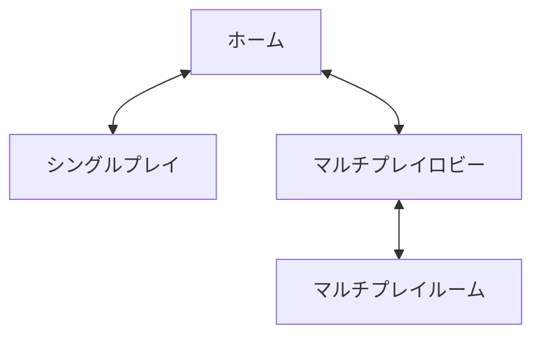

## ホーム

### 機能概要

- 「シングルプレイ」ボタンをクリックすると、「シングルプレイ」ページへ遷移する
- 「マルチプレイ」ボタンをクリックすると、「マルチプレイロビー」ページへ遷移する
- 各ボタンはホバーすると緑色になり、拡大縮小を繰り返す

### 動作画面

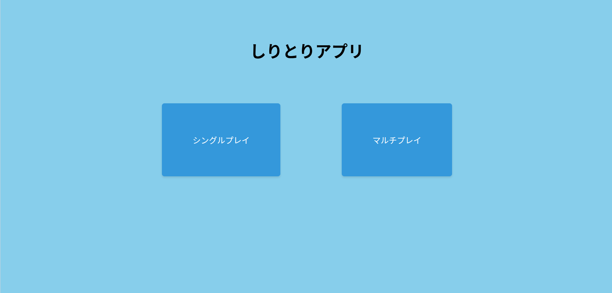 通常のホーム画面

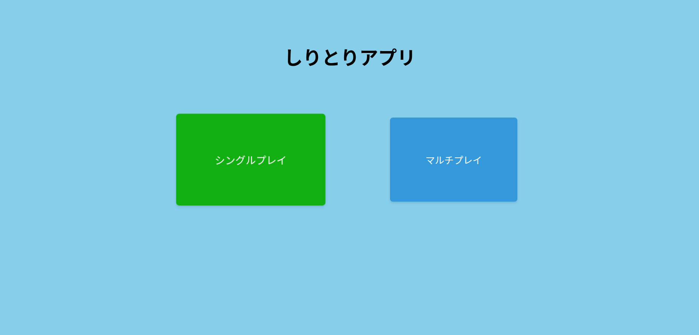
ホバーした「シングルプレイ」ボタン

## シングルプレイ

### 機能概要

- 左上に位置する「戻る」ボタンをクリックすると、ホームへ遷移
- しりとりプレイ中、もしくは「GAMEOBER」画面で「リセット」ボタンをクリックすると、しりとりの単語がリセットされる
- テキストボックスにひらがなで任意の単語を入力すると、サーバに単語を送信することができる
  - ひらがな以外の入力は受け付けず、入力された際に「送信」ボタンが無効化される
- 単語を入力し、「送信」ボタンをクリックすると、サーバ側で入力した単語が前の単語からの続きになっているかを判定する
  - 前の単語からの続きになっていない場合、ブラウザ上にアラートを表示する
- 続きとなる単語の最初の文字は、表示されている前の単語の赤くハイライトされた文字となる
  - 前の単語の末尾文字が`ー`であった場合、1文字前の文字を末尾文字として扱う
  - 前の単語の末尾文字が拗音であった場合、`ゃ`->`や`,
    `ゅ`->`ゆ`のように文字を大きいものに変換したもので判定を行う
- 単語が「ん」で終わる、もしくは同じ単語が2回入力された場合、アラートを表示し、その後「GAMEOVER」画面を表示する
- 「GAMEOVER」画面では、「使用ワード一覧」ボタンが表示され、これをクリックすることで使用した単語一覧を確認することができる

### 動作画面

#### しりとりプレイ

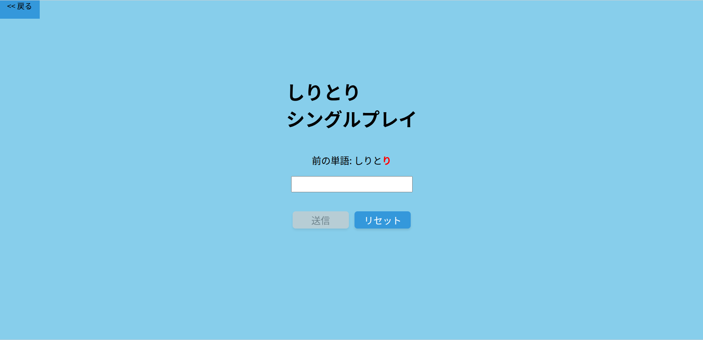 通常のシングルプレイページ

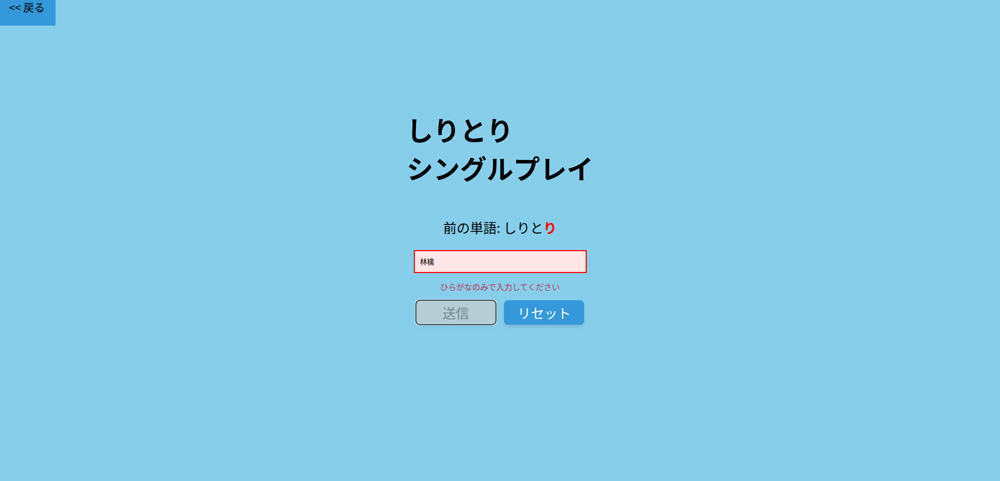 文字列検証により弾かれた入力

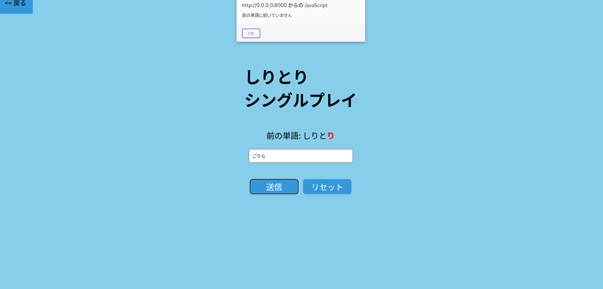 単語が続いていないことによるアラート

#### GAMEOVER

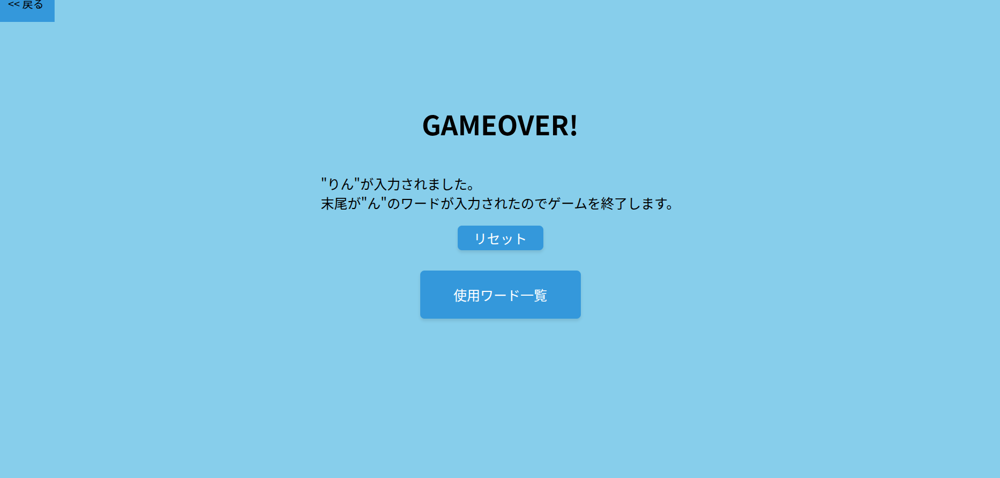 「ん」の入力によるゲームオーバー

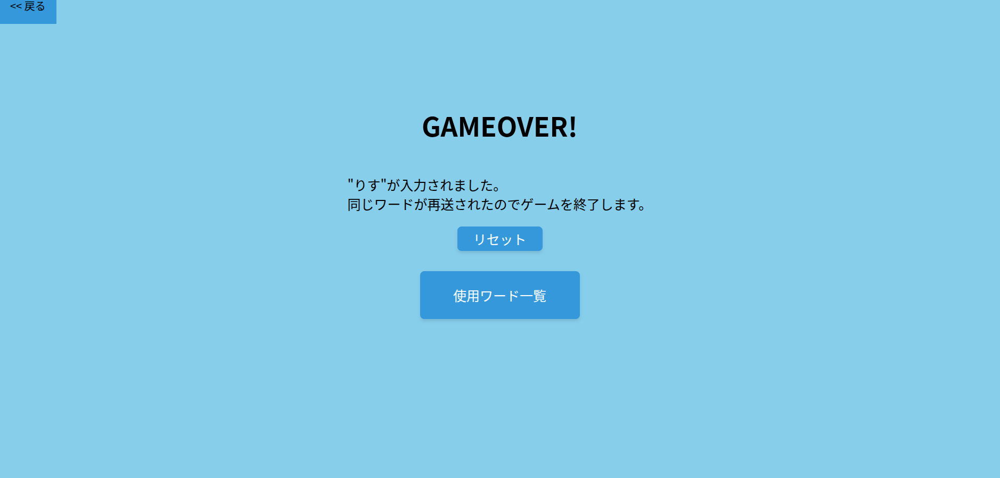 単語の再送によるゲームオーバー

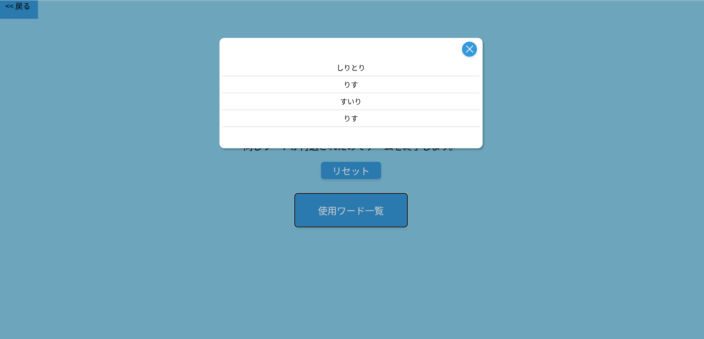 使用ワード一覧確認モーダル

## マルチプレイロビー

### 機能概要

- シングルプレイ同様、「戻る」ボタンでホームへ遷移
- ルームIDとユーザ名を入力し、「ルームに参加」ボタンをクリックすることで、「マルチプレイルーム」ページへ遷移する
- ルームIDの接頭辞が`he11_`である場合、しりとりハードモードのマルチプレイルームへと遷移する

### 動作画面

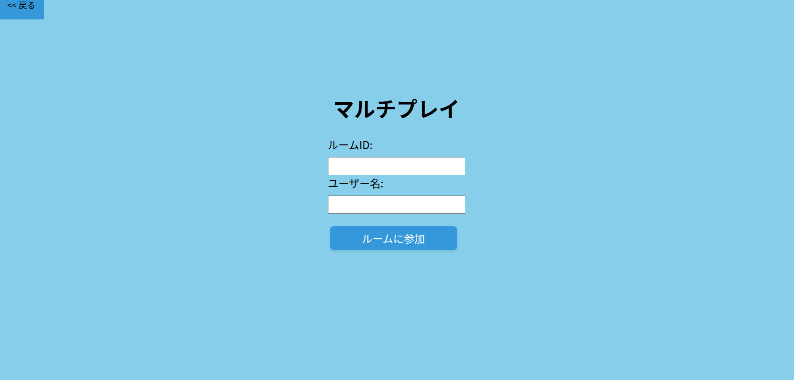 マルチプレイロビー画面

## マルチプレイルーム

### 機能概要

#### マッチング待機

- マルチプレイルームに遷移すると、サーバとWebSocket通信を開始する
  - このWebSocketはルームを退出するまで保持される
- ルームに参加する際、各プレイヤーにはランダムでUUIDと色が割り当てられる
  - このとき割り振られた色は、プレイヤーネームを表示する際に使用される
- 同じルームIDで参加したプレイヤーとマッチングし、マッチングしたプレイヤーが一覧で表示される
- ホストプレイヤーは赤枠で表示され、ホストプレイヤーのみ「ゲームスタート」ボタンが表示される
- 自分のプレイヤーネームは、右側に赤字で`(あなた)`と表示される
- 「ルーム退出」ボタンをクリックすると、WebSocketを切断し、マルチプレイロビーに遷移する
- 「ゲームスタート」ボタンをクリックすると、「しりとり対戦」画面に切り替わる
  - ルーム参加人数が2人未満の場合、ゲームがスタートせず、アラートが出る

#### しりとり対戦

- しりとりの判定や単語の処理方法はシングルプレイと同様
- しりとり対戦画面には、シングルプレイでの表示内容に加え、ターンプレイヤーを表示する
- シングルプレイのしりとり操作に加え、「降参」ボタンをクリックすることで、「降参」を行うことができる
  - 降参をすると、「GAMEOVER」画面に切り替わる
- ターンプレイヤー以外のプレイヤーは、テキストボックスへの入力や「送信」ボタン、「降参」ボタンのクリックを行うことができない
- シングルプレイに存在したリセット機能はマルチプレイでは削除

#### GAMEOVER

- シングルモードのGAMEOVER画面の機能から、「リセット」ボタンを「ルーム退出」ボタンに変更
  - 「ルーム退出」ボタンをクリックすることで、WebSocketを切断し、マルチプレイロビーに遷移
- シングルプレイでは「GAMEOVER!」だった表示を、しりとりに負けたプレイヤーには「YOU
  LOSE!」、勝ったプレイヤーには「YOU WIN!」と表示するように変更

#### ハードモードしりとり対戦

- ルームIDの接頭辞が`he11_`である場合、「しりとり対戦」画面が「ハードモードしりとり対戦」画面に置き換わる
- ハードモードしりとり対戦では、通常のしりとり対戦に加え、次の単語の文字数と末尾文字が指定される
  - 文字数指定は3~8文字からランダムに決定
  - 末尾文字指定は五十音から`を`
    `ん`を除き、濁点・半濁点を加えたものからランダムに決定

### 動作画面

#### マッチング待機

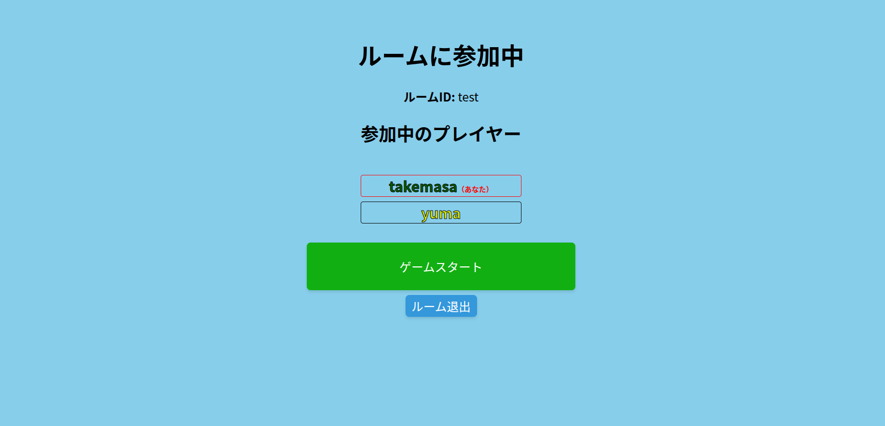 マッチング待機画面

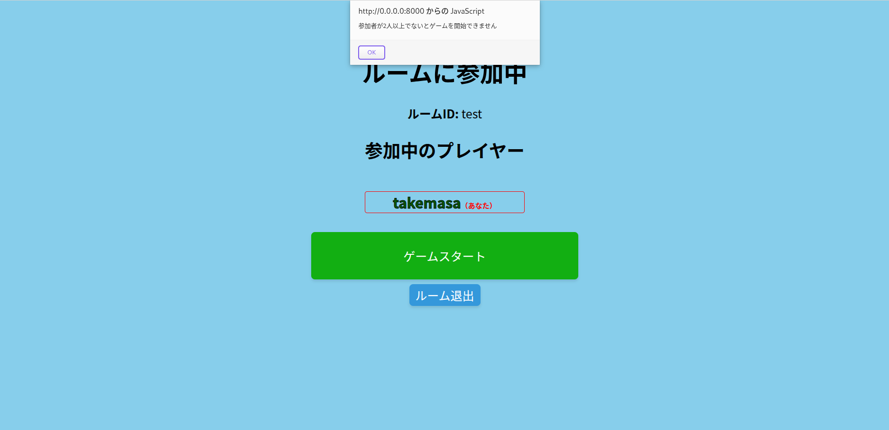
プレイヤーが2人未満時のアラート

#### しりとり対戦

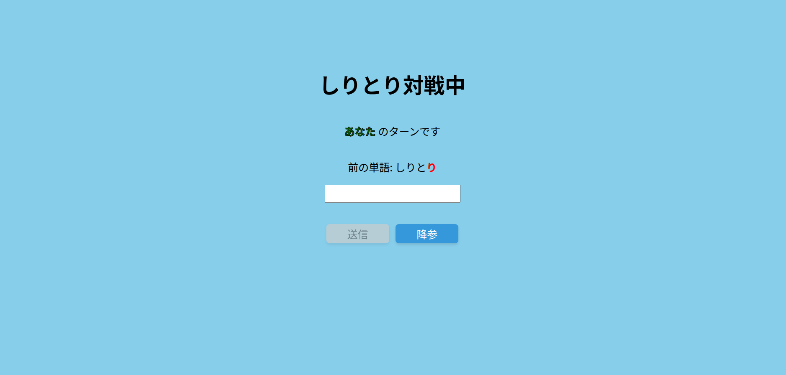
しりとり対戦画面(ターンプレイヤー)

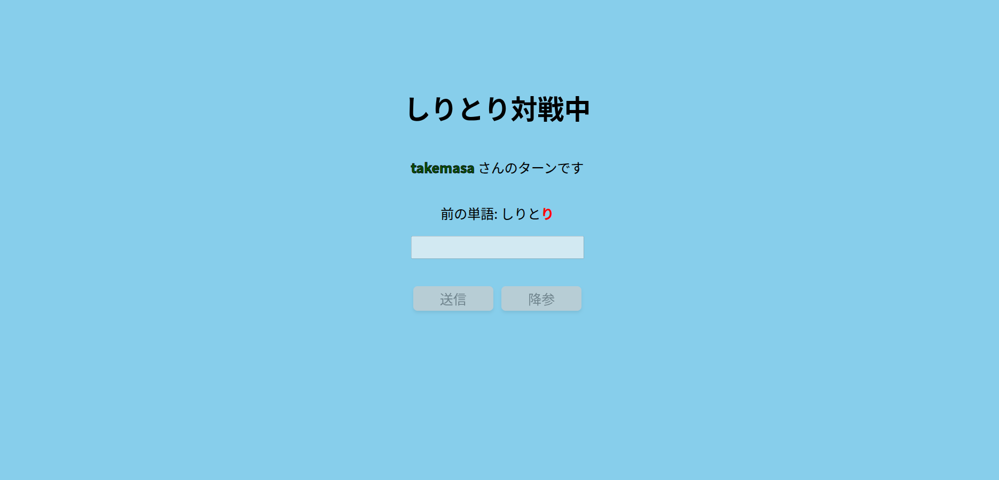
しりとり画面(非ターンプレイヤー)

#### GAMEOVER

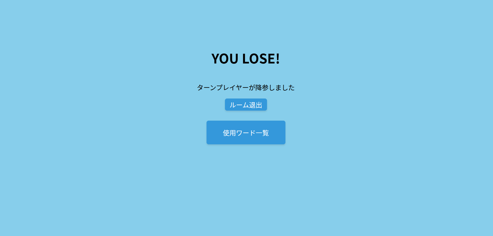 降参によるゲームオーバー

#### ハードモードしりとり対戦

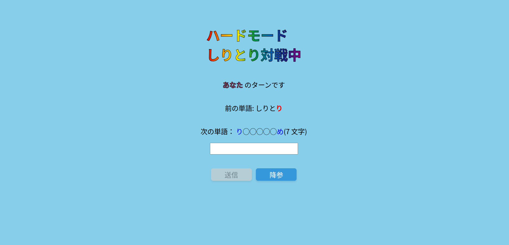
ハードモードしりとり対戦画面

# 動作確認方法

## アプリケーションURL

デプロイしたアプリケーションのURL： https://yuma-harada-word-chain-66.deno.dev

## アプリケーションの実行手順

### 1. denoのinstall

### 2. このリポジトリをclone

```shell
git clone https://github.com/yuma-harada/word-chain-app.git
```

### 3. サーバ起動

リポジトリのルートディレクトリで以下のコマンドを実行

```shell
deno task dev
```

### 4. local serverへアクセス

以下のURLでlocalhost上のserverへアクセスする

```
http://0.0.0.0:8000
```

# 参考にしたWebサイト

- [JavaScriptで平仮名(ひらがな)を判定する](https://qiita.com/thzking/items/f07633e0ee9145a85ace)
- [Unicode 平仮名 - CyberLibrarian](https://www.asahi-net.or.jp/~ax2s-kmtn/ref/unicode/u3040.html)
- [【HTML】ボタン要素にdisabled属性をつけるのをやめませんか？](https://qiita.com/degudegu2510/items/319226d98e05a348b204)
- [盲信的にquerySelectorAllを使用するのを卒業する。\~getElementsBy~と比べてみた\~](https://qiita.com/ari-chel/items/b06c68aec8849d0409dd)
- [JavaScript で配列の最後の要素を取得するもう一つの方法](https://qiita.com/kerupani129/items/64ce1e80eb8efb4c2b21)
- [input要素でEnterキー入力を検出する方法が、いつの間にかアップデートされていた](https://qiita.com/michieru/items/7d95b7b012f741d26732)
- [JavaScriptを使ったモーダルウィンドウの作り方を解説](https://zero-plus.io/media/javascript-modal/)
- [WebSocket サーバーを JavaScript (Deno) で書く](https://developer.mozilla.org/ja/docs/Web/API/WebSockets_API/Writing_a_WebSocket_server_in_JavaScript_Deno)
- [リロードしてもデータを保持するためには「localStorage」](https://qiita.com/Ryusou/items/8bce84e7b036114b8d72)
- [CSSを使って縁取り文字を表現する方法 (デザインサンプル付き)！見出しのデザインの幅を広げる!!](https://wk-partners.co.jp/homepage/blog/hpseisaku/htmlcss/huchidorimoji/)
- [【JavaScript】オブジェクト操作メソッドを理解する Object.entries Object.fromEntriesなど](https://zenn.dev/shimiyu/articles/31d620736a8763)
- [【html/CSS】虹色の作り方【背景・文字・アニメーション】](https://csshtml.work/rainbow/)
- [SetオブジェクトとMapオブジェクトを使いこなそう(JavaScript 基礎構文)](https://press.monaca.io/atsushi/9225)
- [URLアクセスとページリロードの判定処理について](https://supersoftware.jp/tech/20240402/19446/)

# AIを使った部分と使い方

### WebSocketの実装

WebSocketを使用したマルチプレイのマッチングルームの基盤をAIで出力

=>denoでのWebSocketの実装方法の理解や、WebSocketでの実装方針の理解に使用

### Web UIの構築

実装したいUIを提示して、cssファイルを出力

=>出力されたcssファイルを参考にUIを作成
